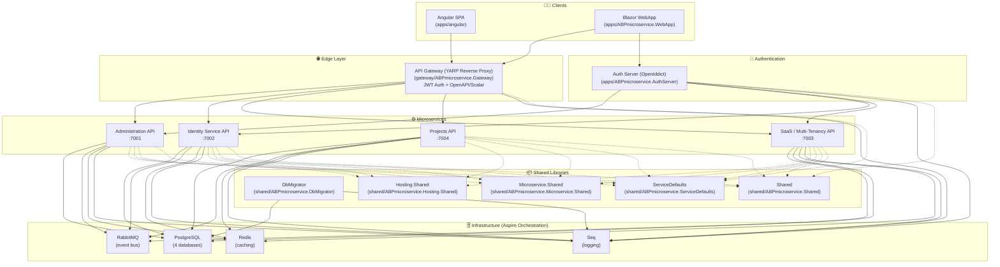
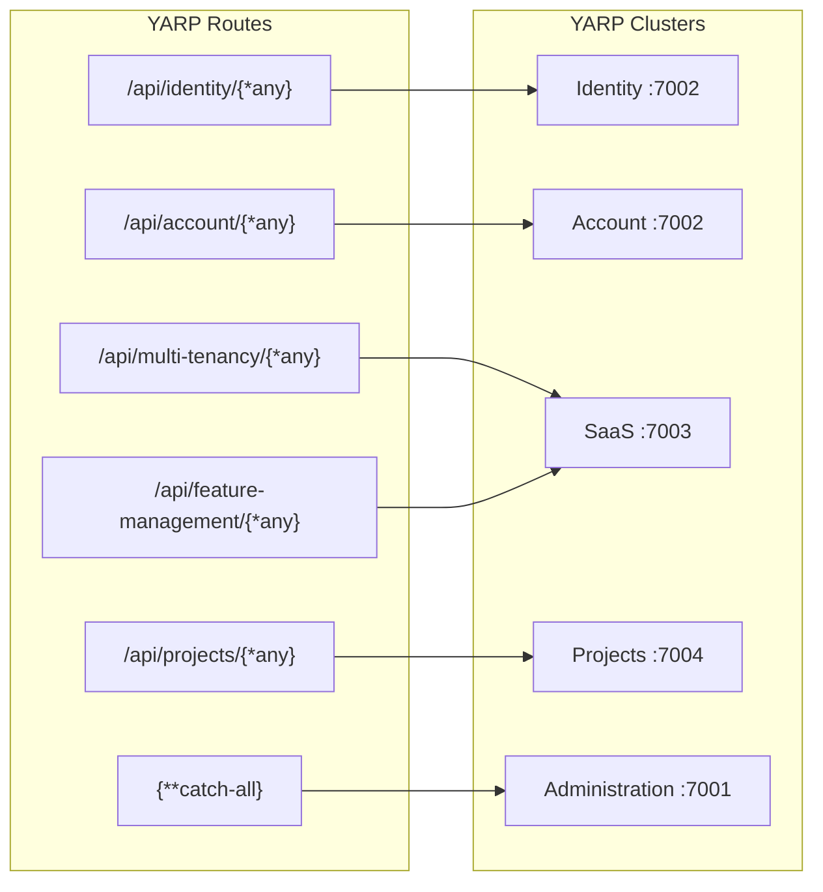
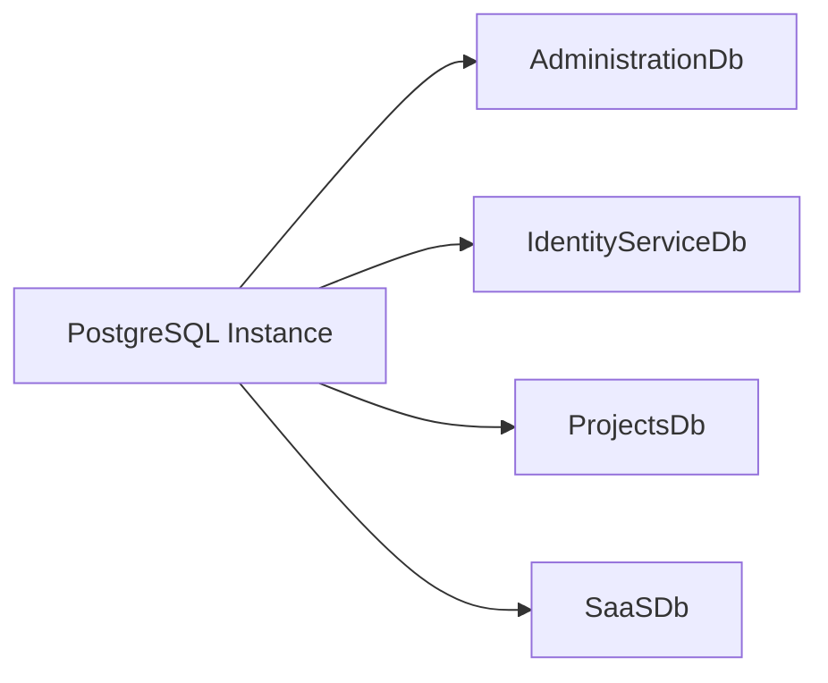
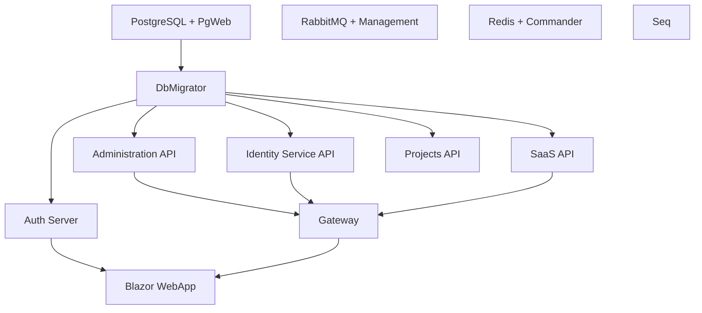

# ABPmicroservice - Architecture & Run Guide

## System Overview



## Gateway Routing (YARP)



## Microservice Internal Layered Architecture (ABP)

Each microservice (e.g., `services/projects`) follows the standard ABP layered architecture:

```mermaid
flowchart TB
    subgraph Host["Host Layer"]
        HttpApiHost["HttpApi.Host<br/>(entry point / DI composition)"]
    end

    subgraph API["API Layer"]
        HttpApi["HttpApi<br/>(Controllers)"]
        HttpApiClient["HttpApi.Client<br/>(client proxies)"]
    end

    subgraph App["Application Layer"]
        AppContracts["Application.Contracts<br/>(DTOs, interfaces, permissions)"]
        App["Application<br/>(AppServices, AutoMapper)"]
    end

    subgraph Domain["Domain Layer"]
        DomainShared["Domain.Shared<br/>(constants, localization, error codes)"]
        Domain["Domain<br/>(entities, domain services)"]
    end

    subgraph Data["Data Layer"]
        EF["EntityFrameworkCore<br/>(DbContext, repositories, migrations)"]
    end

    HttpApiHost --> HttpApi
    HttpApi --> App
    App --> AppContracts
    App --> Domain
    Domain --> DomainShared
    HttpApi --> EF
    App --> EF
    Domain --> EF
    HttpApiClient -.-> HttpApi
```

## Database Layout (PostgreSQL)



## Aspire Orchestration Startup Order



## Project Directory Structure

```
ABPmicroservice/
├── ABPmicroservice.sln
├── apps/
│   ├── ABPmicroservice.AppHost/          # .NET Aspire orchestrator
│   ├── ABPmicroservice.AuthServer/       # OpenIddict auth server
│   ├── ABPmicroservice.WebApp/           # Blazor WebApp (server + client)
│   └── angular/                          # Angular SPA client
├── gateway/
│   └── ABPmicroservice.Gateway/          # YARP reverse proxy + JWT auth
├── services/
│   ├── administration/                   # Administration microservice
│   ├── identity/                         # Identity microservice
│   ├── projects/                         # Projects microservice
│   └── saas/                             # SaaS / multi-tenancy microservice
└── shared/
    ├── ABPmicroservice.DbMigrator/       # Database migration runner
    ├── ABPmicroservice.Hosting.Shared/   # Shared hosting module
    ├── ABPmicroservice.Microservice.Shared/ # Shared microservice module
    ├── ABPmicroservice.ServiceDefaults/  # Aspire service defaults
    └── ABPmicroservice.Shared/           # Core shared module (multi-tenancy)
```

---

# 🚀 How to Run the Project

## Prerequisites

| Tool | Version | Purpose |
|------|---------|---------|
| **.NET SDK** | 9.0+ | Build & run all .NET projects |
| **Docker Desktop** | Latest | Runs PostgreSQL, RabbitMQ, Redis, Seq containers |
| **Node.js** | 20+ | Angular SPA (optional) |
| **Yarn** | Latest | Angular package manager (optional) |
| **Visual Studio 2022** | 17.12+ | Recommended IDE (or VS Code) |

## Option 1: Run Everything with .NET Aspire (Recommended)

This is the simplest way to run the **entire system** — it orchestrates all services, infrastructure, and the Blazor WebApp automatically.

### Steps

1. **Ensure Docker Desktop is running** (Aspire will pull and start the required containers).

2. **Set the AppHost as the startup project**:
   - In Visual Studio: right-click `apps/ABPmicroservice.AppHost` → **Set as Startup Project**
   - Or from CLI:
     ```bash
     dotnet run --project apps/ABPmicroservice.AppHost
     ```

3. **Launch the Aspire profile**:
   - In Visual Studio, select the **`https`** (or `http`) launch profile and press **F5**.
   - From CLI, the `dotnet run` above uses the default profile.

4. **Aspire Dashboard** opens automatically at `https://localhost:17166` (or `http://localhost:15124`). It shows:
   - All running services and their health
   - Logs (via Seq integration)
   - Resource endpoints

5. **Access the applications**:
   | App | URL |
   |-----|-----|
   | Blazor WebApp | `https://localhost:5000` |
   | API Gateway (Scalar/OpenAPI) | `https://localhost:7500` |
   | Auth Server | `https://localhost:7600` |
   | Administration API | `https://localhost:7001` |
   | Identity Service API | `https://localhost:7002` |
   | SaaS API | `https://localhost:7003` |
   | Projects API | `https://localhost:7004` |

> **Note:** The DbMigrator runs automatically first, creating/seeding all 4 databases before the services start.

## Option 2: Run the Angular SPA (Alternative Frontend)

If you prefer the Angular frontend instead of (or alongside) the Blazor WebApp:

```bash
cd apps/angular
yarn install        # or npm install
yarn start          # or npm start
```

This starts the Angular dev server (default `http://localhost:4200`), which is configured to talk to the API Gateway.

> **Note:** The backend services (Option 1) must be running for the Angular app to function.

## Option 3: Run Individual Services Manually

You can run each service independently (useful for debugging a single service). Each service host has its own launch profile:

```bash
# Administration API
dotnet run --project services/administration/host/ABPmicroservice.Administration.HttpApi.Host

# Identity Service API
dotnet run --project services/identity/host/ABPmicroservice.IdentityService.HttpApi.Host

# SaaS API
dotnet run --project services/saas/host/ABPmicroservice.SaaS.HttpApi.Host

# Projects API
dotnet run --project services/projects/host/ABPmicroservice.Projects.HttpApi.Host

# Gateway
dotnet run --project gateway/ABPmicroservice.Gateway

# Auth Server
dotnet run --project apps/ABPmicroservice.AuthServer

# Blazor WebApp
dotnet run --project apps/ABPmicroservice.WebApp/src/ABPmicroservice.WebApp.Blazor
```

> **⚠️ Warning:** Running services manually requires you to manually start the infrastructure (PostgreSQL, RabbitMQ, Redis, Seq) and run the DbMigrator first. Use **Option 1** unless you have a specific reason.

## Infrastructure Management

### Docker Compose (per-service)

Each service folder contains its own `docker-compose.yml` for standalone infrastructure:

```bash
cd services/projects
docker-compose up -d
```

### Clean Build

To remove all `bin` and `obj` folders (useful before a fresh build):

```bash
clean.bat
```

## Default Ports Summary

| Component | HTTPS | HTTP |
|-----------|-------|------|
| Blazor WebApp | 5000 | - |
| API Gateway | 7500 | 7501 |
| Auth Server | 7600 | - |
| Administration API | 7001 | - |
| Identity Service API | 7002 | - |
| SaaS API | 7003 | - |
| Projects API | 7004 | - |
| Aspire Dashboard | 17166 | 15124 |